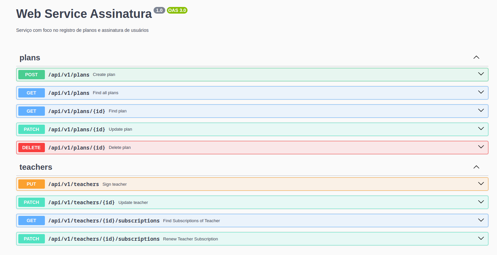

<h1 align="center">Web Service Assinatura</h1>
<p align="center">
  
  
  
</p>

## Descrição

Serviço com foco no registro de planos e assinatura de usuários

## Banco de dados

Utilize um banco gerenciável no MongoDB Atlas referenciando sua url no arquivo _.env_ ou suba um banco de testes usando o _docker.compose.yml_.

MongoDB com Docker Compose:

```bash
$ docker compose up -d
```

## Instalação

```bash
$ yarn install
```

## Rodando o app

```bash
# development
$ yarn run start

# watch mode
$ yarn run start:dev

# production mode
$ yarn run start:prod
```

## Test

```bash
# unit tests
$ yarn run test

# e2e tests
$ yarn run test:e2e

# test coverage
$ yarn run test:cov
```

## Documentação

Acesse o Swagger na url `http://localhost:3000/api#/`:


